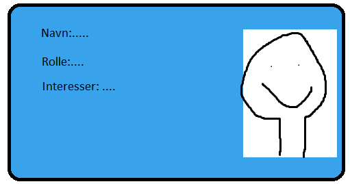
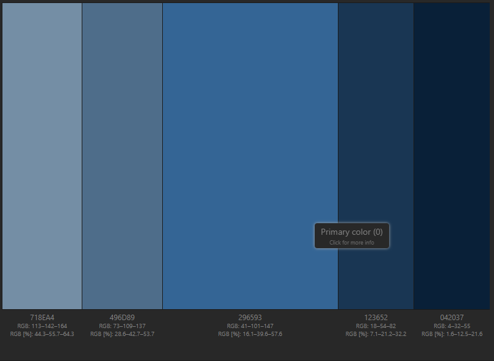

# HWR-Gruppe12A
**Gruppe Medelemmer og deres github navn:**
* Tom André:  @Trivinyx
* Thomas:  @GreaToms
* Ansu:  @kitzch
* Mats:  @Karstad
* Sunniva:  @sunnivalien
* Cathrine:  @Cathrinerh

### Hvordan vi har valgt og arbeide, og fordeling av repitive oppgaver og ansvar
Da vi startet å jobbe på prosjektarbeidet, hadde vi ikke delt opp gruppen, men etter vi hadde jobbet litt, fant vi ut at dette var en _bedre_ måte å jobbe på. Når vi da skulle dele gruppen inn i kodepar, tok vi utgangspunkt i det vi hadde lært om basis html og css og gihub kunnnskaper.

De parene vi har valgt å dele gruppen inn i er:
* Tom og Thomas 
* Sunniva og Mats
* Ansu og Cathrine
 
Dette har vi gjort for at det skal være lettere å jobbe med flere oppgaver samtidig, og at alle skal få bidratt like mye. I tilegg har Tom fått i oppgave å være ansvarlig for all merging, slik at prosessen blir mer ryddig og oversiktlig.

### Design og utfroming, pre og etter
Da vi startet brukte vi github for å bli enige om layout på vissitkort. Her kom alle med hvert sitt forslag, deretter stemte vi på det forslaget vi likte best #3 (Forslag til vissitkort Layout).



Vi endte opp med å bytte plassering av tekst og bilde i resultatet.
 
Etter dette brukte vi Github for å samle bilder og innhold til vissitkortene til alle i gruppen. Oppgaven om å legge inn informasjonen og bildene ble fordelt på to forskjellige personer.

Da vi skulle velge farger til hjemmesiden fikk alle i oppgave å legge frem et forslag av et fargepallet #13(Vis frem en farge plaett fra www.paletton.com som kan passe til nettsiden). Etter det stemte vi over hvilke vi likte best, og så fikk Cathrine i oppgave å legge det inn i CSS #14(Legge inn fargepalett som er valgt).


vi har generellt brukt fargene som vi har valgdt til ca.90% av sidens farger.
### Begynnelsen av index.html og tidligere visitkort.html html biten
I første omgang satt Tom og Thomas sammen og bygde opp selve siden, men de har i senere tid forklart resten av gruppen hva de gjorde #6(Lag en basic hjemmeside index.html).
de skulle igrunn bare legge inn:
```html
<!doctype html>
<html lang="en">
     <head>
          <meta charseth="utf-8">
          <meta name="veiwport" content="width=device-width, initial-scale=1.0">
          <title>hjemmeside</title>
     </head>
     <body>
     </body>
</html>
```
Endte opp med å bli litt revet med i skrivingen, så de lage en index.html som den så ut før den ble merget med vissitkort.html. Innholde som de lagde i index var: 
- En header, med gruppenavn
- En navbar, med fungerende link knapper
- En content section med dummytekst
- En footer til siden

De gjorde det samme med Vissitkort.html, og la inn en røff version av kortene i html format
```html
<div class="kort">
     
     <div class="kortText">
          <p class="name">Navn</p>
          <p class="role">rolle</p>
          <p class="info">info tekst</p>
     </div>
</div>
```
### Kort om hvordan vi startet med CSS
I første omgang lagde Tom og Thomas en egen css fil som de linket fra html dokumetet. 
```html 
<meta href="style/style.css" rel="stylesheet">
```
Videre så stylet de index og visittkort fra css filen til å se nesten som den nåværende, før merge av index og visittkort. En annen ting de også gjorde var å style visittkortene.
det elemntene som ble stylet under denne sesjonen var:
- Header, backgund og tekst
- Navbar, med linker, kanpper osv.
- footer, backgrunn og tekst
- conteiner for pusterom på siden:
```css
 .container{
            width: 80%;
            min-width: 275px;
            margin: auto;
        }
```
- noen mideltige farger

### Etter denne starten
Etter at Tom og Thomas hadde sittet og lagd det som blir beskrevet over, tok Tom og delte skjerm, viste hva som var gjort, forklarte de individuelle tingene i html og css, tok imot feedback. Dette førte til at alle på gruppen var inneforstått med hva som var gjort og hvordan det fungerte selvom de ikke direkte hadde skrevet det.
I etkkerant av dette ble det satt opp issues for fargevalg #13 og inleggelse av dette #14, andre issues som ble satt opp var at alle skulle legge inn hver sin bit på navn og infor. Vi ble enige om at Rollen skulle være IT student.

Bug-fix, endringer og kontroller; Vi har brukt Github til å komme med forslag til eventuelle endringer og fiksing av bugs. 
#15 (fikse centrering av vissitkort) - Få kortene til å være centrert i CSS, etter at de begynner å legge seg på linje. Og #23 (fikse at kortene flyttes når bildet ikke finnes) Dette ble fikset da issue #15 ble fikset på. 
#17 (Sjekk at alt av text er lagt inn for bildene direkte i html) - Sjekk at alt= "tekst" i tagger for bilder er tilstede, og at den beskriver bildet på en forstårlig måte. Utbedre der dette trengs. 
#37 (Endring av farger) -  Etter vi hadde bestemt oss så vi at fargene ikke passet helt sammen, så vi bestemte oss for å bytte fargepalett.

Vi har en egen issue for diskusjon til forslag til utbedringer og/eller endringer til web-siden, hvor man kan komme med innspill. #18

Tom og Thomas fikk i opgave å kommentere all koden til html og css filer i index.html filen vår #19(Kommentere koden til html og css filer). 

### Når vi fikk oppdatert oppgave info
første som ble gjort når vi fikk denne var og lage issues på filer som skulle lages. når dette var gjort var det å få det eksisterende arbeidet som var gjort til og bli akseptert under de nue retningslinjene som denne konkritiseringen av oppgaven ga oss.
Vi løste det ved at Tom tok contentet fra vissitkort og paste over til Index, mens Thomas og Sunniva så på #27(Merge index.html og vissitkort.html). Vi hadde lagd hver sin fil til html og css, så Tom fikk i oppgave å ta css filen sitt inhold fra style.css og implimentere det inn i html-dokumentet #28(Take css content from sttyle.css and implement it in the html doc. dette var da Sunniva og Thomas med på prosessen.

I forbindelse med dette, var det på dette tispunktet at vi oprette kodepar, og at tom som eier av repositoryet hadde ansvar for og merge opp til main.

- Mats og Sunniva lagde filen som heter how-we-roll.html. Der de også la inn basic html for wc3 godkjennelse #29(Lag Html.doc how-we-roll.html). 
- Videre lagde Cathrine og Ansu en html fil med navn hwr-report.html, der de også la inn basic doc med w3c godkjennelse #30(lag html hwr-report.html). 
- Ansu og Cathine lagde også en md fil med tittelHWR-GRUPPE12A.md #31(lag HWR-GRUPPE12A.md)

Grunnen til at disse parene gjorde dette er at tom og thomas hadde gjort en god del fra før av.

### HWR-Form
når det kom til innholde i HWR.html, bestemte vi oss for at alle parene skulle produsere sitt egedt forslag i ver sin branch på hvordan formen skulle være. dette ble satt opp som seperate issues #41, #42 og #43. linked til vær sin brach og kodepar
- #41 HWR-form-1, Tom og Thomas
- #42 HWR-form-2, Cathrine og Ansu
- #43 HWR-form-3, Sunniva og Mats

vi valgdte utifra alle sine ferdige forslag og merge brachen HWR-form-3 til Main, og bygge videre på denne.

#53 - Lagt inn standar stylen vi brukte på index.html til HWR-report.html. (Navbar, footer, body og css klasser.
#55 - Lagt til javascript i how-we-roll-html, hentet fra: https://github.com/digitnow/how-we-roll

#56- Laget et canvas element, for å vise frem dataene samlet inn i .json filer fra how-we-roll.html formen.
#57 - Lagt inn javascript til henting av data i HWR-report.html, javascript er hentet fra: https://github.com/digitnow/how-we-roll 

#61 - Diskusjon - Komme med endringer eller nye spørsmål til HWR.html, #62 - Legge inn endelige spørsmål på HWR.html

#65 (universell utforming)

Forandringer knyttet til issue #66: Endret fargekontraster for bedere leslighet på alle html dokumenter. Gjort om på skygge på knapper, og fikset at skyggen ikke blir grønn når en trykker på den. Fjernet border tykkelsesforandring på knappene når en hovrer. Endret på transparanse verdi på visitkort kortene. Lagdt til tekstfarge på onHover effeckten til visitkortene slik at de er lettere og lese når man hovrere over de. Navbar backgrunns size, linjehøyde på knapper så de ikke overlapper. Forandret på visuell framstilling av html coden i teksteditor for hwr-report.html

#68 - Legge inn sin egen form url link i hwr-report i script (Fylle inn trxid og timestamp)
